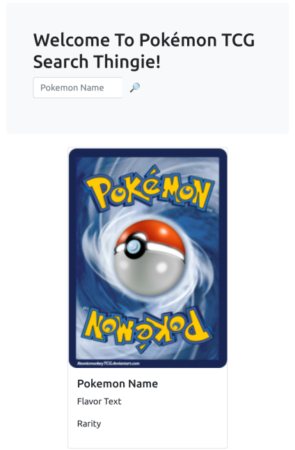

# 1SCJRBB-Quarkus

## Trabalho final da Disciplina Quarkus

### Descrição

Para o trabalho final da disciplina Quarkus, desenvolvemos um sistema básico de consulta de cards do jogo Pokémon: TCG.



O Quarkus ficou com a parte de backend E frontend, graças à lib Quinoa, feita para permitir a subida de uma aplicação frontend feita em Javascript, HTML e CSS carregada diretamente junto com com o pacote Java.

Tecnologias utilizadas:

- Docker
- NodeJS
- MongoDB
- Quarkus
  - Quinoa
  - Panache(MongoDB)
  - RESTeasy Reactive

### Instruções para subir o projeto

É necessário que você tenha o Docker e o Docker Compose instalados e funcionando. Você também precisa do Quarkus. O projeto foi construído com o Java 17.

1- clonar o Repositório

2- cavegar até a raiz do projeto

3- execute o script ```build-and-run.sh``` se estiver no Linux, ou ```build-and-run.ps1``` se estiver no Windows.

4- aguarde a subida dos serviços

5- com os serviços funcionando, navegue para a URL ```http://localhost:8080/```. Você verá a SPA do projeto.

6- o uso é simples, basta escrever o nome do card que deseja consultar e clicar na Lupa 🔎️.

7- Você pode interromper o funcionamento com o comando ```docker-compose down``` na raiz do projeto.

## Equipe

Carlos Mateus Borges Junior - RM344974

Daniel de Oliveira Carvalho - RM344795

Pedro Sant Anna Lima Oliveira - RM344804

Willian Prestes Correia Cellos - RM344812
